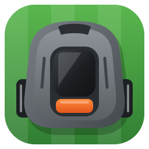

<p align="center">
  
</p>

# HusqA Cockpit

An unofficial Windows client for Husqvarna Automower® robotic lawnmowers, developed in C# / .NET.

HusqA Cockpit (**Husq**varna **A**utomower) shows all the mowers of a Husqvarna account side by side, lets you
control them from the desktop and raises Windows notifications when one of them needs attention.
It uses the official [Automower Connect API](https://developer.husqvarnagroup.cloud/apis/automower-connect-api).

> **Independent project, not affiliated with, endorsed by or supported by Husqvarna AB.** It uses the public Automower
> Connect API with your own application key, under Husqvarna's terms for that API. Automower® is a trademark of
> Husqvarna AB, named here only to designate the mowers this software talks to.

> This README, like most of the code in this repository, was written by Claude (Claude Code, Anthropic), under the supervision of Armand Delessert.

## Features

- **Dashboard** with one card per mower: activity, battery, next scheduled start, current error, cutting height,
  headlights and time of the last update.
- **Commands**: mow for a given duration, pause, park (until the next schedule, until further notice or for a duration),
  resume the schedule — per mower or for all mowers at once.
- **Mower details**: cutting height and headlight settings, lifetime statistics, event history, blade-usage counter
  reset, error acknowledgement.
- **Schedule editor**: add, change and remove the weekly time slots of a mower (start, end, days). An end of 00:00 means
  midnight, so 00:00–00:00 is the whole day. Overlapping slots, empty days and slots running past midnight are rejected
  before anything is sent.
- **Map**: an OpenStreetMap map with the GPS track of a mower on its detail page, and a *Map* page showing the tracks
  of all mowers together.
- **Windows notifications** for errors, theft alarms, recoveries, stops requiring a manual action and connectivity changes
  (each category can be turned off), and, if you ask for them, when a mower **starts** and when it **finishes mowing**
  (Settings › Notifications: none, end only, or start and end; none by default). The start says why the mower left
  (its schedule, a command from the app, or a manual start) and the end how long the task lasted.
- **Notification area icon**: the app keeps watching the mowers when its window is closed; the icon gets a red badge when
  a mower is in error. Optional start with Windows.
- **French and English** user interface (follows Windows by default).

## Getting started

### 1. Create a Husqvarna API key

1. Sign in to the [Husqvarna developer portal](https://developer.husqvarnagroup.cloud/) with your Automower Connect account.
2. Create an application, then connect it to the **Authentication API** and the **Automower Connect API**.
3. Copy the application key and the application secret.

### 2. Install the app

1. Download the zip of the [latest release](https://github.com/ArmandDelessert/husqvarna-automower-windows/releases/latest)
   for x64 or ARM64.
2. Unzip it and start `HusqaCockpit.exe` in the folder. Nothing else to install: .NET and the Windows App SDK are
   included.
3. Open **Settings**, paste the key and secret, then click **Save and connect**. They are stored in the Windows
   Credential Manager of the current user, never in plain text.

The executable is not signed: on first launch, Windows SmartScreen asks for a confirmation ("More info", then
"Run anyway").

Requirements: Windows 10 version 2004 (build 19041) or later, or Windows 11, and the Microsoft Edge WebView2 runtime
(preinstalled on Windows 11; used for the map).

Preferences, the WebView2 cache and the logs (one file a day, kept a week) are stored in `%LOCALAPPDATA%\HusqA Cockpit`.

## How it works

| Concern | Approach |
|---|---|
| Authentication | OAuth2 client credentials. The 24-hour token is cached in the Credential Manager: Husqvarna rejects logins that are too frequent (`simultaneous.logins`). |
| Live updates | WebSocket `wss://ws.openapi.husqvarna.dev/v1` (v2 events), with keep-alive and reconnection before the server's 2-hour limit. |
| Fallback | If the WebSocket is unavailable (e.g. HTTP 403), the app polls `GET /mowers` periodically (10 minutes by default). |
| Rate limits | Requests are serialized and spaced by ≥ 1.1 s (limit: 1 request/second). The Settings page shows this month's request count (limit: 10,000 per month and per key). |
| Map | [Leaflet](https://leafletjs.com/) (bundled, BSD-2-Clause) in a WebView2; only the OpenStreetMap tiles are loaded from the Internet. The track is made of the last 50 positions reported by the mower. |
| Start and end of mowing | The API's `state` is `IN_OPERATION` while the mower works, recharging included (activity `CHARGING` "due to low battery"), and `RESTRICTED` when it may not mow (schedule, parking, daily limit, frost, sensor). A task starts on `RESTRICTED` → `IN_OPERATION` and ends on `IN_OPERATION` → `RESTRICTED`; the activity and the battery level cannot tell a recharge from the end. Pauses, stops and errors are not ends, and nothing is reported for a mower that was out of reach or already mowing when the app started. |
| Time stamps | Next start, error and message times are sent in the mower's local time; they are interpreted in the PC's time zone. |

## Development

Requirements: Windows 10 version 2004 or later, or Windows 11, and the
[.NET 10 SDK](https://dotnet.microsoft.com/download/dotnet/10.0) (version pinned by `global.json`).
Visual Studio is not required.

```bash
dotnet build
dotnet test
dotnet run --project src/HusqaCockpit.App
```

The tests use xUnit v3 on Microsoft.Testing.Platform, enabled in `global.json`; `dotnet test --coverage` also
measures code coverage.

### Project structure

```
src/HusqaCockpit.Core                  API client, WebSocket event feed, fleet state and alert detection (no UI)
src/HusqaCockpit.Presentation          View models, status sentences and the abstractions they need (no UI framework)
src/HusqaCockpit.App                   WinUI 3 application (unpackaged): views, tray icon, notifications, settings storage
tests/HusqaCockpit.Core.Tests          xUnit tests for the Core library, including the monitor and the reconnection loop
tests/HusqaCockpit.Presentation.Tests  xUnit tests for the view models and the status sentences
tools/strings                          Source of the UI strings and error-code texts (generates the .resw files)
assets                                 Vector sources of the logo and of the icons (not shipped with the app)
```

Only the App project depends on WinUI: the view models reach the UI thread, the strings and the settings through
interfaces, so their tests run without a desktop. Time-dependent code (refresh intervals, back-off, keep-alive) runs
on a `TimeProvider`, simulated in the tests.

### Tooling

- `global.json` pins the SDK. `Directory.Build.props` enables the .NET analyzers (`latest-recommended`) and treats every
  warning as an error; it also holds the product name and the version. `Directory.Packages.props` keeps all package
  versions in one place.
- `.github/workflows/ci.yml` builds and runs the tests on every push, on any branch, and checks that the `.resw` files
  match their Python sources.
- `.github/workflows/release.yml` publishes a release for every `vX.Y.Z` tag.

### Publishing a release

The version number comes from the Git tag. Pushing a tag `vX.Y.Z` (or `vX.Y.Z-beta.1` for a pre-release) builds that
version, runs the tests, then creates the GitHub release with the self-contained application for x64 and ARM64, each in
a zip, and their SHA-256 checksums:

```bash
git tag v1.0.0
git push origin v1.0.0
```

A local build has the version `0.0.0-dev`.

### Translations

Edit `tools/strings/ui_strings.py` or `tools/strings/error_codes.py`, then regenerate the resource files:

```bash
python tools/strings/generate_resw.py
```

## Known limitations

- **Real-time events may be refused (HTTP 403)** for some application keys whose token lacks the `amc:api` scope.
  The app then falls back to periodic refreshes. Renewing the key or reconnecting the Automower Connect API to the
  application on the developer portal usually fixes it.
- The schedule of mowers with work areas (EPOS / NERA models) cannot be edited yet.
- The map shows the last 50 positions reported by the mower, not the full history of the day.
- Work areas and stay-out zones (EPOS / NERA models) are not displayed yet.
- Mowers are assumed to be in the same time zone as the PC.
- The end of mowing notification also fires when a restriction interrupts the task (rain sensor, frost, a daily limit),
  because the API only says the mower may no longer mow. The duration includes the recharges, and is missing when the
  app did not see the start. In polling mode, a task shorter than the refresh interval is not seen at all.

## Disclaimer

- This project is not affiliated with, endorsed by or supported by Husqvarna AB. Automower® is a trademark of
  Husqvarna AB.
- Using the Automower Connect API requires your own application key from the Husqvarna developer portal and is subject
  to Husqvarna's terms for that API, including its request quotas.
- No warranty: commands are sent to real mowers. Check what you send, especially schedules.

## License

[MIT](LICENSE)
